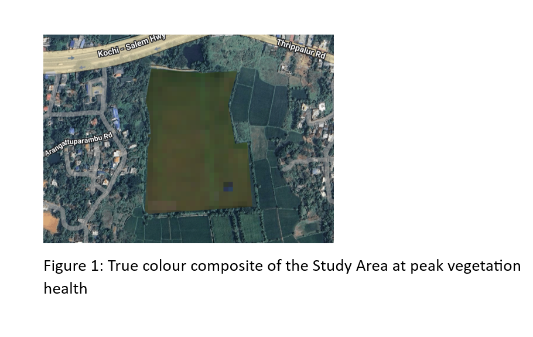
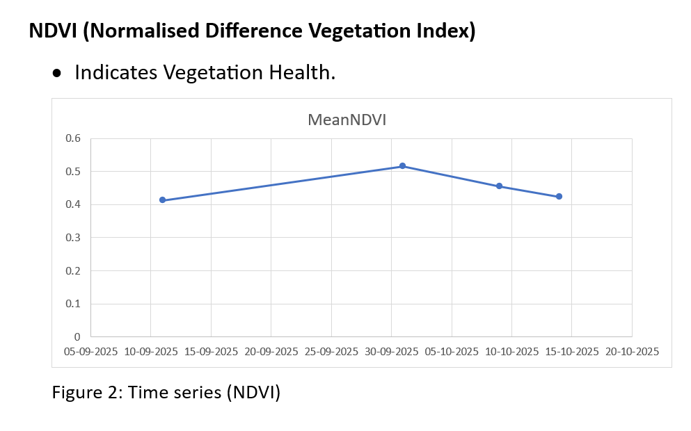
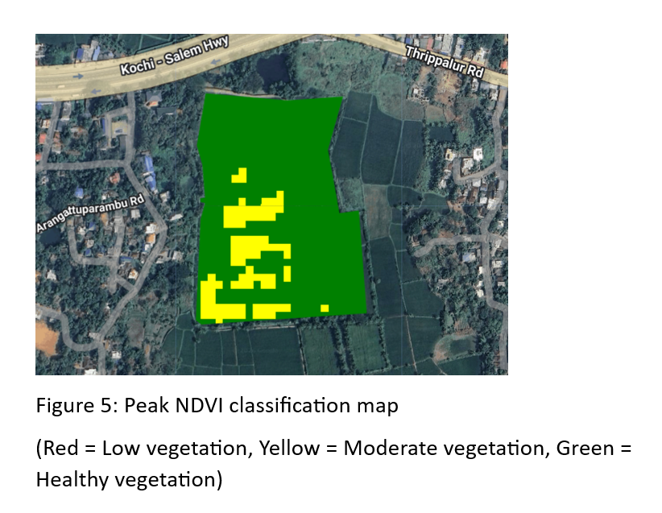
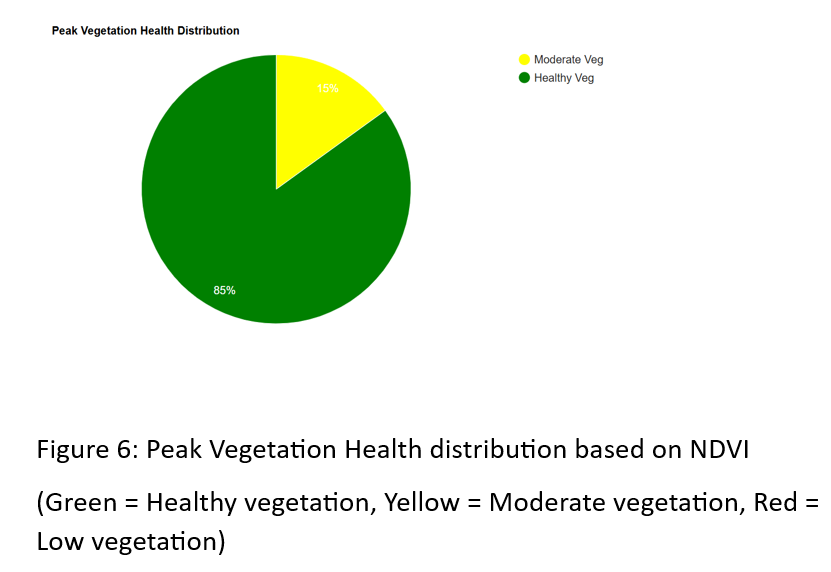
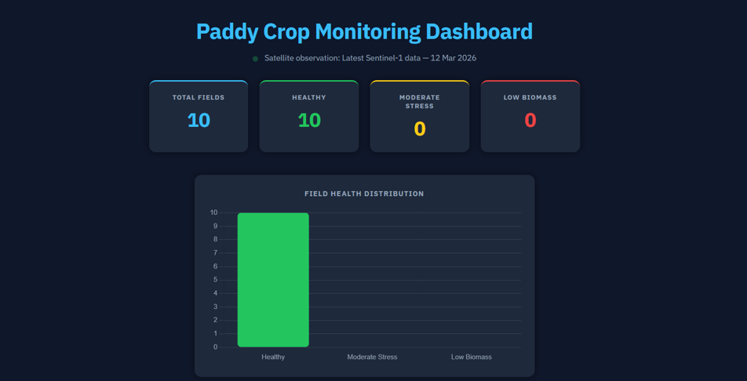
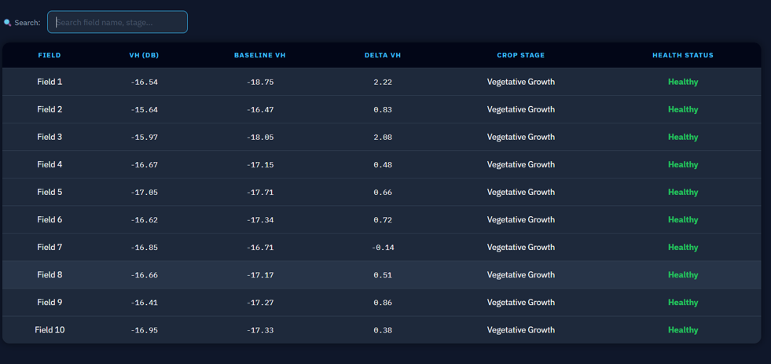
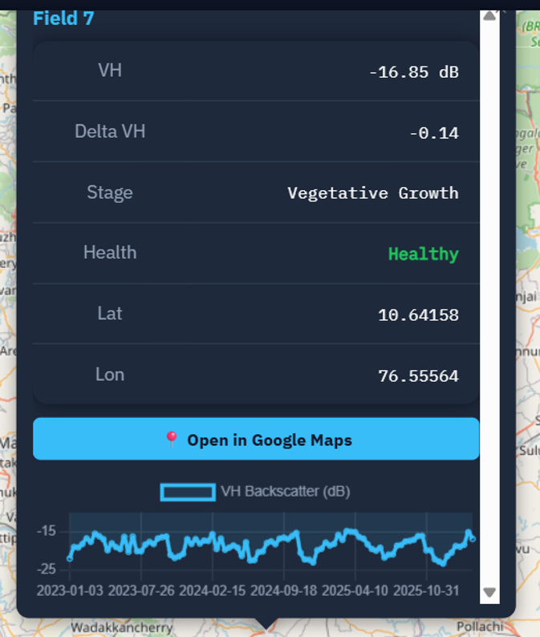

# Satellite-Based Crop Health Monitoring

A satellite-based crop monitoring project developed during an internship, combining Google Earth Engine, Sentinel-1 SAR, Sentinel-2 optical imagery, field-level temporal analysis, and a Flask web dashboard.

## Overview

This project explores how satellite observations can be transformed into field-level crop health information and presented through an interactive monitoring system.

The work includes two connected components:

- **Alathur crop-health analysis** using Sentinel-2 and Sentinel-1 data for a paddy field in Alathur, Kerala.
- **Multi-field crop monitoring system** using Sentinel-1 SAR to monitor 10 paddy fields through field-level VH time series, seasonal baselines, crop-stage classification, and health assessment.

The project was developed as part of an internship focused on applying remote sensing and geospatial technologies to agricultural monitoring.

## Key Technologies

- Google Earth Engine
- Sentinel-1 SAR
- Sentinel-2 Surface Reflectance
- NDVI and NDWI
- Python
- Flask
- JavaScript
- Leaflet
- Geospatial and temporal analysis

## Project Structure

```text
satellite-crop-health-monitoring/
├── gee/
│   ├── alathur_analysis.js
│   └── multi_field_monitoring.js
├── dashboard/
│   ├── app.py
│   ├── requirements.txt
│   ├── Procfile
│   └── templates/
│       └── index.html
├── docs/
│   ├── alathur_analysis.md
│   └── dashboard.md
└── results/
    └── README.md

## Live Dashboard

The project includes a Flask-based web dashboard for visualizing field-level crop health and Sentinel-1 observations.

**Live dashboard:** [Open Dashboard](https://paddy-dashboard.onrender.com)

## Results

### Alathur Crop Analysis









### Multi-Field Monitoring Dashboard







## What I Worked On

- Developed Google Earth Engine workflows for Sentinel-1 and Sentinel-2 satellite analysis.
- Analyzed NDVI, NDWI, and Sentinel-1 VH backscatter for agricultural monitoring.
- Built field-level temporal analysis for 10 paddy fields.
- Implemented seasonal baseline comparison and rule-based crop health classification.
- Developed a Flask dashboard to visualize field-level monitoring results.
- Integrated geospatial visualization using Leaflet and interactive charts.
