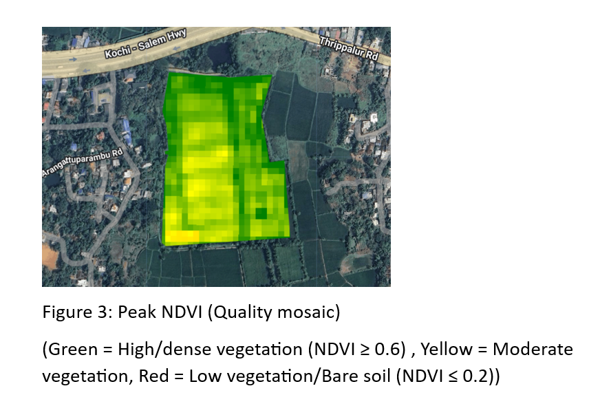
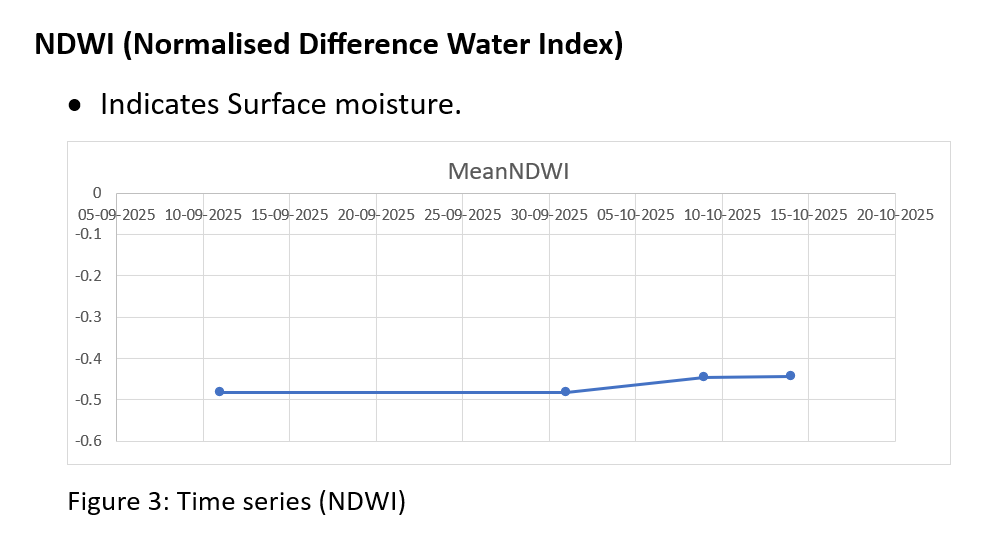
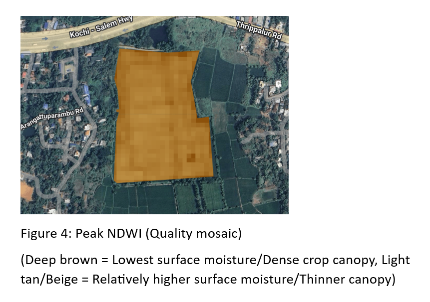
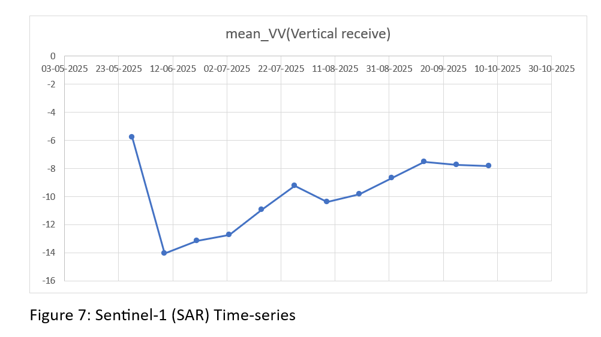

# Results

This folder contains selected outputs from the crop-health monitoring work.

## Alathur Paddy Field Analysis

The Alathur analysis combined Sentinel-2 optical imagery and Sentinel-1 SAR observations to study paddy crop condition through the growing season.

### Study Area

### NDVI Analysis

### NDWI Analysis

### Vegetation Health Classification

The final NDVI-based classification reported approximately **85% Healthy Vegetation**, **15% Moderate Vegetation**, and **0% Low Vegetation**.

### Sentinel-1 SAR Analysis

The SAR time series was used to complement optical observations during periods affected by cloud cover and to examine patterns associated with flooding and crop development.

## Multi-Field Monitoring

The monitoring system extends the analysis to **10 paddy fields** using field-level Sentinel-1 VH observations.

It produces:

- VH time series
- Current crop-stage classification
- Seasonal baseline VH
- Change from seasonal baseline
- Field-level health status
- Interactive crop-health visualization
